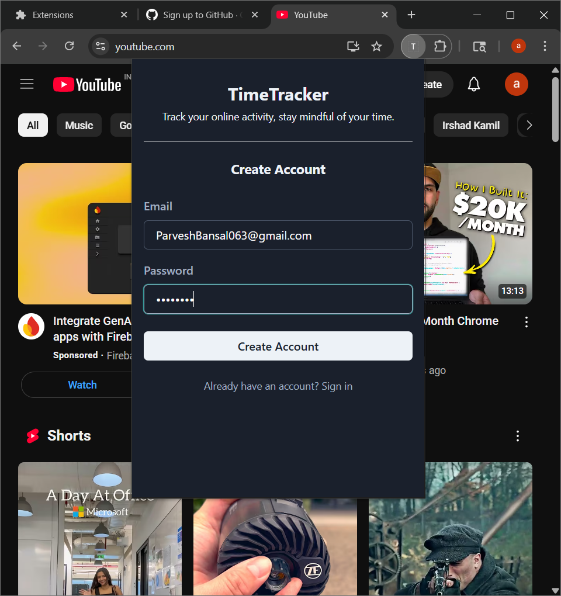
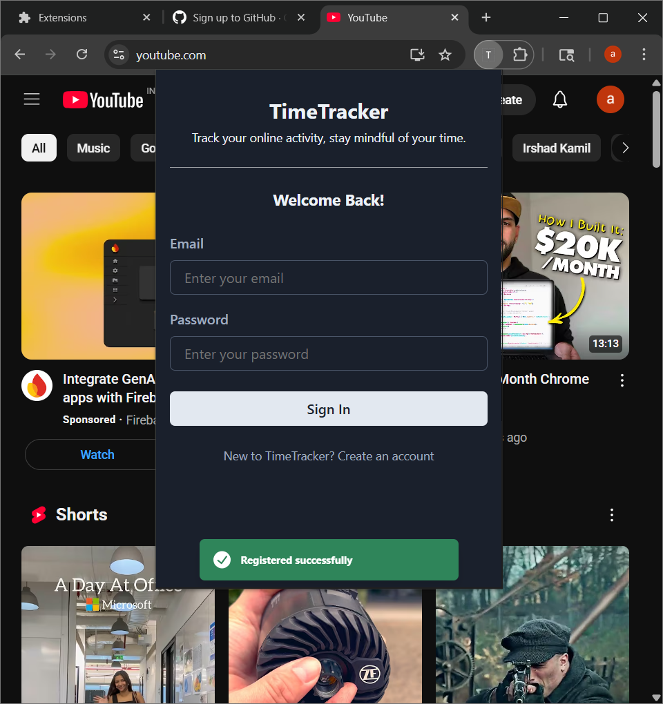
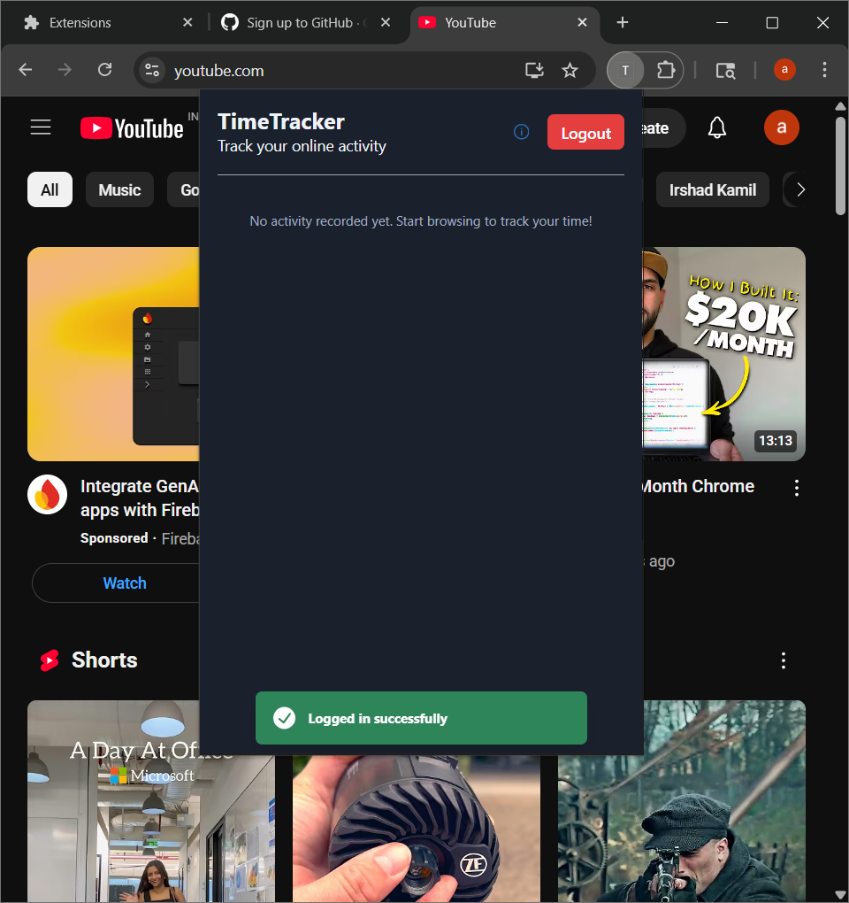
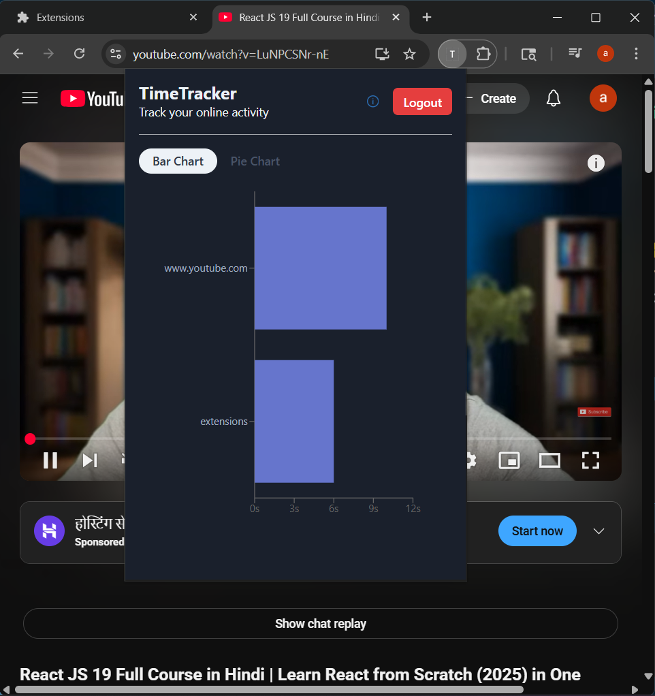
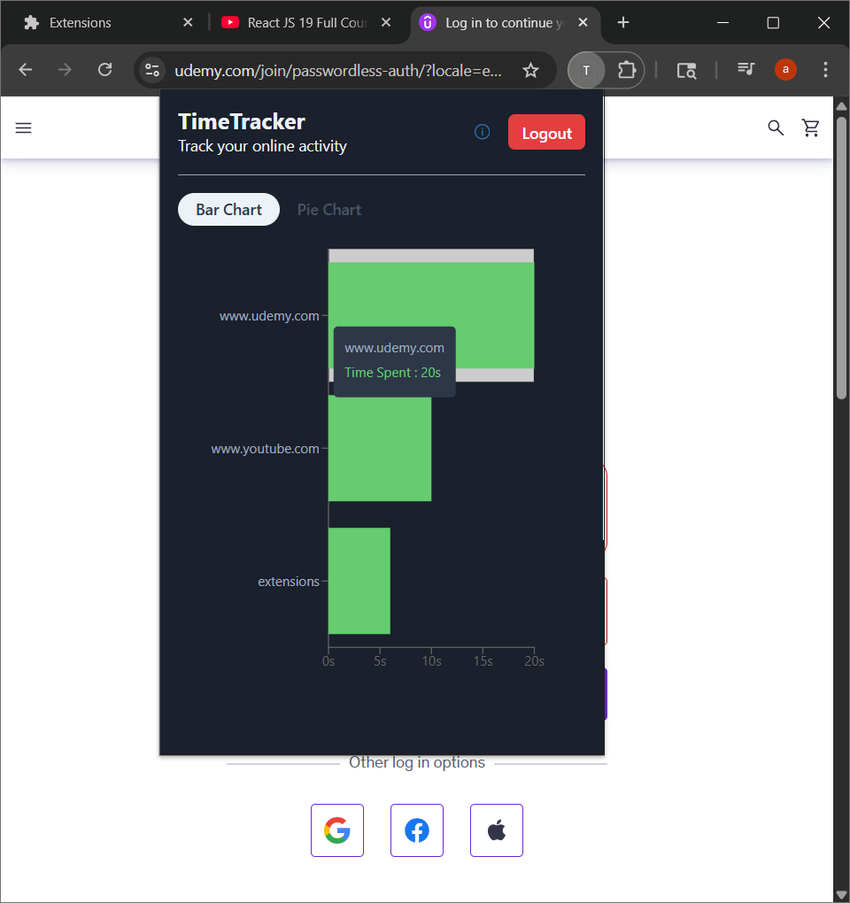
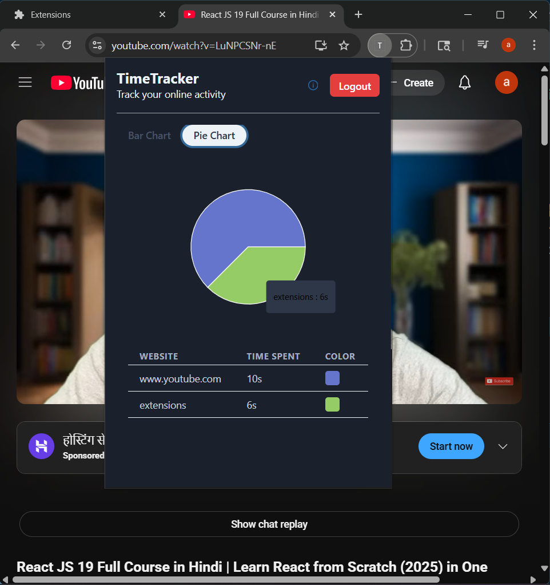
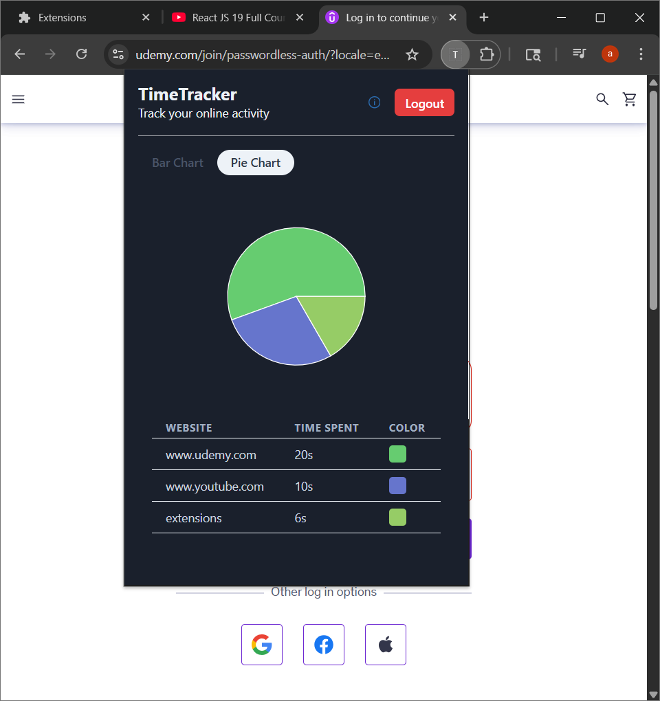
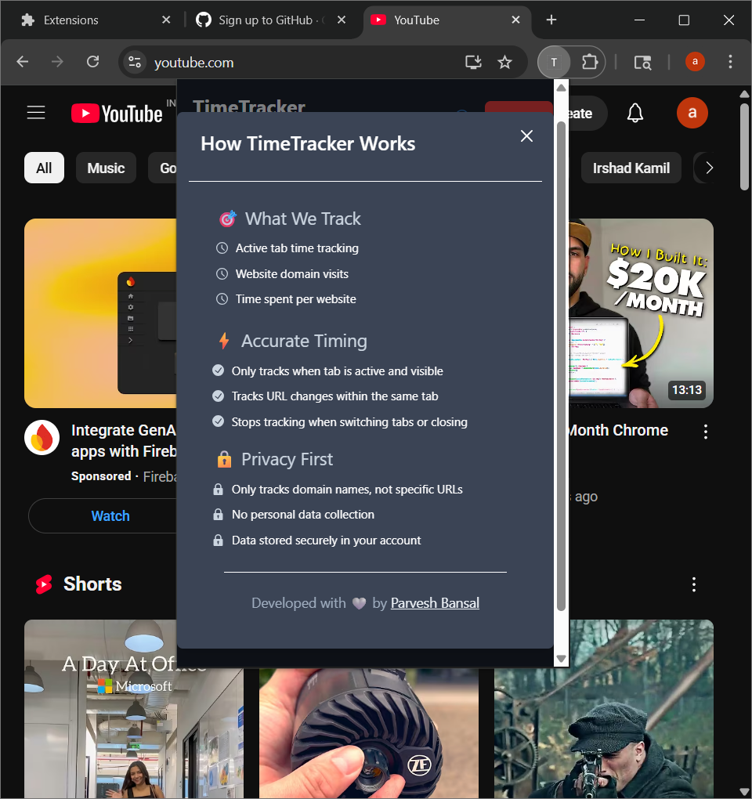

# ⏱️ TimeTracker Chrome Extension

**Track your online activity, stay mindful of your time.**

**TimeTracker** is a full-stack Chrome Extension that helps you monitor and visualize the time you spend on each website, with a modern React-based popup and a Node.js + MongoDB backend.

---

## 💡 Features

- ⏱️ Real-time website activity tracking
- 📊 Interactive pie and bar charts for daily usage
- 🔒 Local authentication (using email and password)
- 🎨 Modern React popup with Chakra UI
- ℹ️ Info modal for usage tips
- 🔗 REST APIs to log and fetch data from database

---

## 🗂️ Project Structure

```
extension/
├── backend/
│   ├── package.json
│   ├── server.js
│   ├── config/
│   ├── cron/
│   ├── models/
│   └── routes/
├── client/
│   ├── background.js
│   ├── dev-server.js
│   ├── manifest.json
│   ├── package.json
│   ├── vite.config.js
│   ├── public/
│   └── src/
│       ├── App.jsx
│       ├── index.jsx
│       ├── popup.css
│       └── components/
│           ├── Auth.jsx
│           ├── ChartDisplay.jsx
│           ├── InfoModal.jsx
│           └── store/
└── README.md

## 🗂️ Project Structure
```

---

## � How to Use

### 🚀 Getting Started: Clone the Repository

```bash
git clone https://github.com/PARVE5H/chrome-productivity-tracker-extension.git
```

### 1. **Backend Setup**

```bash
cd backend
npm install
node server.js
```

### 2. **Client (Extension) Setup**

```bash
cd client
npm install
npm run build
```

### 3. **Load Extension in Chrome**

1. Open Chrome and go to `chrome://extensions/`
2. Enable "Developer mode"
3. Click "Load unpacked" and select the `client/dist` folder

---


## 📸 Screenshots  

 **Register Page:**  

      
      

 **Login Page:**  

    
    

 **Bar Chart:**  

      
      

 **Pie Chart:**  

      
      

 **Info Modal:**  
 
  

---

## 👤 About Me

Hi! I'm Parvesh Bansal, a passionate developer building tools to help people understand and improve their digital habits. Feel free to reach out or contribute!

---
## 🔗 Connect with Me

- 💼 [LinkedIn](https://www.linkedin.com/in/parvesh-bansal/)  
- ✖️ [X (Twitter)](https://twitter.com/parve5h)  
- 📸 [Instagram](https://www.instagram.com/parve5h)  
- 📧 [Email Me](mailto:parveshbansal063@gmail.com)  
- 👨‍💻 [GitHub Profile](https://github.com/parve5h)

---

## 📝 License

This project is licensed under the MIT License.

---

